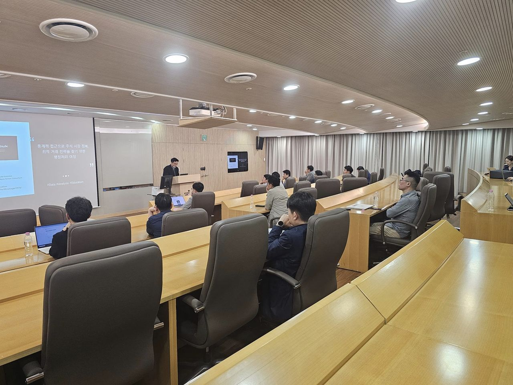

# Parallel Processing in R and Python

This repository contains the materials and code examples presented by Daniel at the Korean R Meetup, sponsored by Kyobo Life Insurance. The audience primarily comprised professionals from the financial sector. The presentation showcased the power of parallel processing in financial analysis, leveraging both Python and R.



## Presentation Overview

The main focus of this presentation was on parallel processing techniques used in financial analytics. The original codebase was developed for the "Python Quant PairsTrading" online course. Instead of completely refactoring the Python scripts to R, we used Quarto to seamlessly integrate Python and R code. This approach allowed us to utilize the best features of both languages effectively.

### Key Highlights:

- **Parallel Processing with R**: Utilized the `do.par` package in R for efficient parallel processing.
- **Integration of Python and R**: Demonstrated using Quarto, blending Python's computational power with R's statistical prowess.
- **Financial Sector Application**: Tailored examples and discussions relevant to financial analytics and trading strategies.

## Code Snippets

Below are snippets showing how Python and R can be used together in Quarto to perform complex financial analyses:

```{python}
# Python 
def trading_summary_wt_parameters(df_whole, pair, margin_init, margin_ratio):
    pair_trading_summary_ls = [
        PairTradingFinancialAnalysis(df_whole = df_whole, pair = pair, margin_init = margin_init, margin_ratio = margin_ratio, 
        window = window, zscore_threshold = zscore_threshold).trading_summary()
        for window in range(3,30,1)
        for zscore_threshold in np.linspace(2.0, 4.0, 21)
    ]
    pair_trading_summary_df = pd.DataFrame(pair_trading_summary_ls).sort_values(by='margin', ascending=False)
    return pair_trading_summary_df
```
```{r}
# R
data_1d_backtesting <- fread("./data/data_1d_backtesting.csv") %>% as.data.frame()
```
```{r}
# R
trading_summary_wt_parameters <- function(pair, df_whole = data_1d_backtesting, margin_init = 3000, margin_ratio = 0.25) {
  param_grid <- expand.grid(
    window = 3:29,
    zscore_threshold = seq(2.0, 4.0, length.out = 21)
  )
  
  results_list <- apply(param_grid, 1, function(params) {
    window <- params[1]
    zscore_threshold <- params[2]
    trading_summary(df_whole, pair, as.numeric(window), as.numeric(zscore_threshold), margin_init, margin_ratio)
  })
  
  results_df <- do.call(rbind, results_list)  # Convert list of results to a dataframe
  results_df <- results_df[order(-results_df$margin), ]  # Sort dataframe by 'margin' in descending order
  return(results_df)
}

```

## How to Use This Repository

Clone the repository to access and run the provided R and Python scripts:

```bash
git clone https://github.com/danielyouk/R-meetup-ParallelProcessing.git
```

## Contact
If you're interested in further developing or adapting this project, or if you have any questions regarding the business application of these techniques, please contact Daniel at daniel@datatrain.education.